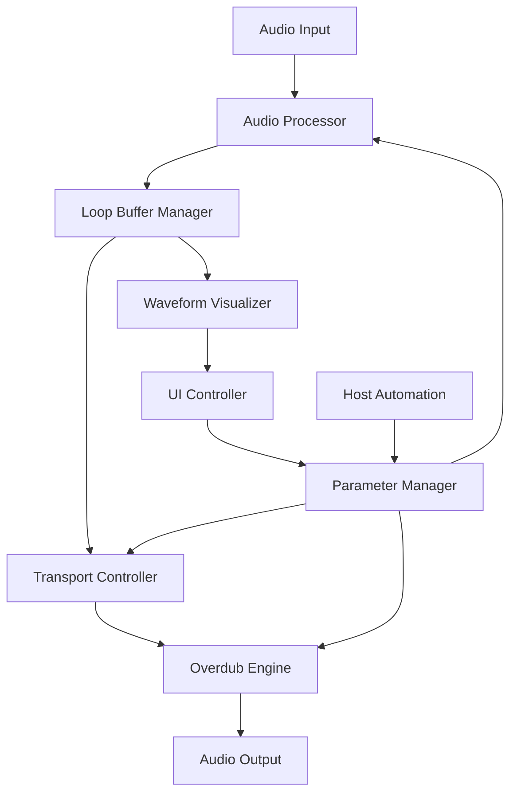

# Design Document: Audio Looper

## Overview

The audio looper will be implemented as a comprehensive audio processing system within the existing OpenLooper2 JUCE VST3 plugin. The design follows a modular architecture with clear separation between audio processing, state management, and user interface components. The system will provide professional-grade audio looping capabilities including recording, playback, overdubbing, and real-time parameter control.

## Architecture

The looper system consists of five main components:



### Component Responsibilities

- **Audio Processor**: Main audio processing entry point, coordinates all audio operations
- **Loop Buffer Manager**: Manages circular audio buffer storage and retrieval
- **Transport Controller**: Handles playback state, timing, and synchronization
- **Overdub Engine**: Manages audio layering and feedback processing
- **Parameter Manager**: Handles plugin parameters and automation
- **UI Controller**: Manages user interface and visual feedback
- **Waveform Visualizer**: Provides real-time waveform display

## Components and Interfaces

### Loop Buffer Manager

The Loop Buffer Manager implements a high-performance circular buffer system for audio storage:

```cpp
class LoopBufferManager {
public:
    void initialize(double sampleRate, int maxChannels, float maxLengthSeconds);
    void writeAudio(const juce::AudioBuffer<float>& input, int startSample, int numSamples);
    void readAudio(juce::AudioBuffer<float>& output, int startSample, int numSamples, float position);
    void setLoopLength(int lengthInSamples);
    void clear();
    
private:
    juce::AudioBuffer<float> circularBuffer;
    std::atomic<int> writePosition{0};
    std::atomic<int> loopLengthSamples{0};
    int maxBufferSize;
};
```

**Key Features:**
- Lock-free circular buffer implementation using atomic operations
- Dynamic loop length adjustment
- Efficient memory management with pre-allocated buffers
- Support for up to 60 seconds of audio at 192kHz sample rate

### Transport Controller

The Transport Controller manages playback state and timing:

```cpp
class TransportController {
public:
    enum class State { Stopped, Recording, Playing, Overdubbing };
    
    void processBlock(int numSamples);
    void startRecording();
    void stopRecording();
    void startPlayback();
    void stopPlayback();
    void startOverdub();
    void stopOverdub();
    
    State getCurrentState() const;
    float getPlaybackPosition() const; // 0.0 to 1.0
    
private:
    std::atomic<State> currentState{State::Stopped};
    std::atomic<float> playbackPosition{0.0f};
    double sampleRate;
    int samplesPerBlock;
};
```

**Key Features:**
- Thread-safe state management using atomic variables
- Precise playback position tracking
- Sample-accurate timing for loop boundaries
- Integration with host transport when enabled

### Overdub Engine

The Overdub Engine handles audio layering with configurable feedback:

```cpp
class OverdubEngine {
public:
    void processOverdub(juce::AudioBuffer<float>& buffer, 
                       const juce::AudioBuffer<float>& input,
                       float feedbackLevel);
    void setFeedbackLevel(float level); // 0.0 to 1.0
    void setOverdubGain(float gain);    // 0.0 to 2.0
    
private:
    float currentFeedbackLevel{0.8f};
    float currentOverdubGain{1.0f};
    juce::SmoothedValue<float> feedbackSmoothing;
    juce::SmoothedValue<float> gainSmoothing;
};
```

**Key Features:**
- Configurable feedback level for creative loop degradation
- Smooth parameter interpolation to prevent audio artifacts
- Overdub gain control for balancing new and existing content
- High-quality mixing algorithms preserving audio fidelity

### Parameter Manager

The Parameter Manager handles all plugin parameters and automation:

```cpp
class ParameterManager {
public:
    // Parameter IDs
    static constexpr const char* RECORD_ID = "record";
    static constexpr const char* PLAY_ID = "play";
    static constexpr const char* STOP_ID = "stop";
    static constexpr const char* OVERDUB_ID = "overdub";
    static constexpr const char* FEEDBACK_ID = "feedback";
    static constexpr const char* VOLUME_ID = "volume";
    
    void createParameters(juce::AudioProcessorValueTreeState& apvts);
    void updateFromParameters(const juce::AudioProcessorValueTreeState& apvts);
    
private:
    std::atomic<bool> recordTriggered{false};
    std::atomic<bool> playTriggered{false};
    std::atomic<bool> stopTriggered{false};
    std::atomic<bool> overdubTriggered{false};
    std::atomic<float> feedbackLevel{0.8f};
    std::atomic<float> volumeLevel{1.0f};
};
```

**Key Features:**
- Full VST3 automation support for all parameters
- Thread-safe parameter access using atomic variables
- Trigger-based button parameters for transport control
- Continuous parameters for feedback and volume control

## Data Models

### Audio Buffer Structure

The circular buffer uses a power-of-2 size for efficient modulo operations:

```cpp
struct CircularAudioBuffer {
    juce::AudioBuffer<float> buffer;
    std::atomic<int> writeHead{0};
    std::atomic<int> readHead{0};
    int bufferSize;           // Always power of 2
    int bufferMask;          // bufferSize - 1 for fast modulo
    
    void write(const float* input, int numSamples, int channel);
    void read(float* output, int numSamples, int channel, int offset = 0);
};
```

### Loop State Information

```cpp
struct LoopState {
    TransportController::State transportState;
    float playbackPosition;      // 0.0 to 1.0
    int loopLengthSamples;
    float loopLengthSeconds;
    bool isRecording;
    bool isOverdubbing;
    float currentVolume;
    float currentFeedback;
};
```

### Waveform Display Data

```cpp
struct WaveformData {
    std::vector<float> peakLevels;    // Peak levels for visualization
    std::vector<float> rmsLevels;     // RMS levels for visualization
    int samplesPerPixel;
    float displayRange;               // Time range in seconds
    std::atomic<bool> needsUpdate{false};
};
```

## Correctness Properties

*A property is a characteristic or behavior that should hold true across all valid executions of a system-essentially, a formal statement about what the system should do. Properties serve as the bridge between human-readable specifications and machine-verifiable correctness guarantees.*

### Property 1: Transport State Management
*For any* sequence of transport control button presses (record, play, stop, overdub), the looper should transition to the correct state and maintain consistent behavior according to the state machine rules.
**Validates: Requirements 1.1, 1.2, 1.4**

### Property 2: Loop Timing Consistency  
*For any* recorded loop, the playback timing should remain exactly consistent across all playback cycles, overdub operations, and state transitions.
**Validates: Requirements 1.3, 2.2, 3.3**

### Property 3: Overdub Audio Mixing
*For any* existing loop and new audio input during overdub, the mixed result should contain both the original loop content and the new audio content without timing drift or audio artifacts.
**Validates: Requirements 2.1, 2.3, 2.5**

### Property 4: Loop Length Management
*For any* recording operation, the automatically determined loop length should match the actual recording duration and be maintained consistently for all subsequent operations.
**Validates: Requirements 3.1, 3.2**

### Property 5: Audio Quality Preservation
*For any* audio processing operation (recording, playback, overdub), the output should maintain 32-bit floating-point precision and be free of artifacts such as clicks, pops, or quality degradation.
**Validates: Requirements 5.1, 5.5, 2.4**

### Property 6: Performance Requirements
*For any* audio processing block, the looper should process audio within the specified latency limits and CPU usage constraints while supporting all required sample rates.
**Validates: Requirements 5.2, 5.3, 5.4**

### Property 7: Parameter Automation
*For any* parameter change via host automation, the looper should respond immediately and smoothly without audio glitches while maintaining all parameter values in saved project state.
**Validates: Requirements 6.1, 6.2, 6.3, 6.4**

### Property 8: Host Integration
*For any* host transport state change or sync configuration, the looper should respond appropriately while maintaining its core functionality.
**Validates: Requirements 6.5, 3.5**

### Property 9: Memory Management
*For any* loop length configuration or memory allocation scenario, the system should allocate memory efficiently, stay within limits, and handle low-memory conditions gracefully.
**Validates: Requirements 7.1, 7.2, 7.4, 7.5**

### Property 10: Error Resilience
*For any* error condition (buffer underruns, invalid data, allocation failures, invalid inputs), the looper should handle the error gracefully and continue operation without crashing.
**Validates: Requirements 8.1, 8.2, 8.3, 8.4, 8.5**

### Property 11: UI State Synchronization
*For any* looper state change, the user interface should immediately reflect the current state with appropriate visual feedback, waveform display, and progress indication.
**Validates: Requirements 4.2, 4.3, 4.4, 4.5**

### Property 12: Lock-Free Real-Time Processing
*For any* audio processing operation in the real-time thread, no blocking operations or locks should be used to ensure deterministic performance.
**Validates: Requirements 7.3**

## Error Handling

The looper system implements comprehensive error handling to ensure robust operation:

### Audio Processing Errors
- **Buffer Underruns**: Continue processing with silence insertion, log warning
- **Invalid Sample Rates**: Gracefully fallback to supported rates with user notification
- **Audio Format Mismatches**: Automatic conversion with quality preservation

### Memory Management Errors
- **Allocation Failures**: Reduce buffer size automatically, disable recording if necessary
- **Memory Leaks**: Automatic cleanup on plugin destruction and state changes
- **Buffer Overflows**: Circular buffer protection with bounds checking

### Parameter Validation
- **Range Checking**: All parameters validated against defined ranges before application
- **Type Safety**: Strong typing for all parameter values with automatic conversion
- **Thread Safety**: Atomic operations for all real-time parameter access

### Host Integration Errors
- **Unsupported Configurations**: Graceful degradation with user warnings
- **Automation Conflicts**: Priority system for resolving parameter conflicts
- **State Restoration**: Validation and fallback for corrupted state data

## Testing Strategy

The audio looper will be validated using a dual testing approach combining unit tests and property-based tests:

### Unit Testing
Unit tests will focus on specific examples, edge cases, and integration points:
- **Component Integration**: Test interactions between major components
- **Edge Cases**: Boundary conditions for loop lengths, sample rates, and buffer sizes
- **Error Conditions**: Specific error scenarios and recovery mechanisms
- **UI Interactions**: Button press sequences and visual feedback validation

### Property-Based Testing
Property-based tests will validate universal correctness properties using the **JUCE UnitTest framework** with custom property test generators:

**Configuration**: Each property test will run a minimum of 100 iterations to ensure comprehensive coverage through randomization.

**Test Tagging**: Each property test will be tagged with the format:
**Feature: audio-looper, Property {number}: {property_text}**

**Property Test Implementation**:
- **Property 1-12**: Each correctness property will be implemented as a separate property-based test
- **Random Input Generation**: Smart generators for audio buffers, parameter values, and user interactions
- **Invariant Checking**: Automated verification of system invariants after each operation
- **State Space Exploration**: Comprehensive testing of all valid system state combinations

### Test Data Generation
- **Audio Generators**: Random audio content with controlled characteristics (frequency, amplitude, duration)
- **Parameter Generators**: Valid parameter ranges with edge case inclusion
- **Sequence Generators**: Random but valid sequences of user interactions
- **Configuration Generators**: Various plugin configurations and host environments

### Integration Testing
- **Host Compatibility**: Testing with multiple DAW environments
- **Automation Testing**: Comprehensive parameter automation scenarios
- **Performance Testing**: CPU usage and memory consumption validation
- **Real-Time Testing**: Latency and timing accuracy verification

The testing strategy ensures both specific functionality validation through unit tests and comprehensive correctness verification through property-based testing, providing confidence in the looper's reliability and performance.